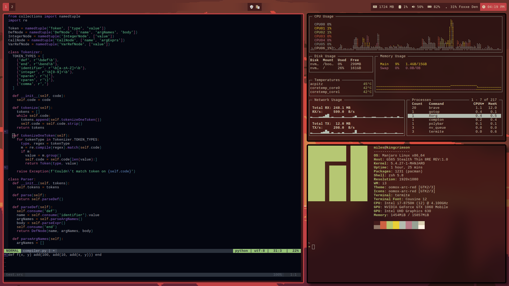

These are my dotfiles for my workstation. They are setup as a bare repository.

For more information on a setup like this, check [the atlassian tutorial](https://www.atlassian.com/git/tutorials/dotfiles) or one of the many similar articles.

### [neovim](https://neovim.io/) editor - [.config/nvim](.config/nvim)
- [Dein](https://github.com/Shougo/dein.vim) plugin manager - [den.vim](.config/nvim/dein.vim)
- [CoC](https://github.com/neoclide/coc.nvim) - [coc-settings.json](.config/nvim/coc-settings.json)
  - CoC extensions are preferred to Vim extensions when reasonable for performance
  - Such as `coc-yank` for yank highlighting and `coc-eslint` for JS linting
- [Moonlight](http://vimcolors.com/1189/moonlight/dark) theme
- See [.config/nvim/plugins.vim](.config/nvim/plugins.vim) for a full list of plugins

### [zsh](https://www.zsh.org/) shell - [.zshrc](.zshrc)
- [Oh My Zsh](https://ohmyz.sh/) configuration framework
- [Spaceship](https://denysdovhan.com/spaceship-prompt/) theme

### [i3](https://i3wm.org/) window manager - [.config/i3](.config/i3)
- More specifically, the [i3-gaps-rounded](https://github.com/resloved/i3) fork
- This config is highly specific to my setup at this point

### [Polybar](https://github.com/polybar/polybar) status bar - [.config/polybar](.config/polybar)
- I use [Font Awesome](https://fontawesome.com/) for icons
  - Requires access to pro icons to use all the icons I use, but can easily be changed

### [Termite](https://github.com/thestinger/termite) terminal - [.config/termite](.config/termite)

### Personal Theme - [.themes/oomox-arc-red](.themes/oomox-arc-red) [.icons/oomox-arc-red](.icons/oomox-arc-red)
- [Wallpaper](https://i.imgur.com/19oujdw.png) is the Risk of Rain end cutscene
- Made with [Oomox](https://github.com/themix-project/oomox)
- Some theming is embeded in other files

# Installation
The directory `$HOME/dotfiles` is used in this example, but any directory can be used.
As is the same for the `dotfiles` command.
```bash
git clone --bare https://github.com/MilesManners/dotfiles.git $HOME/dotfiles
alias dotfiles='/usr/bin/git --git-dir=$HOME/dotfiles/ --work-tree=$HOME'
dotfiles config --local status.showUntrackedFiles no
dotfiles checkout
```

### Optionally add the `dotfiles` alias to your `.bashrc`, `.zshrc`, etc.
```bash
echo "alias dotfiles='/usr/bin/git --git-dir=$HOME/dotfiles/ --work-tree=$HOME'" >> $HOME/.zshrc
```
